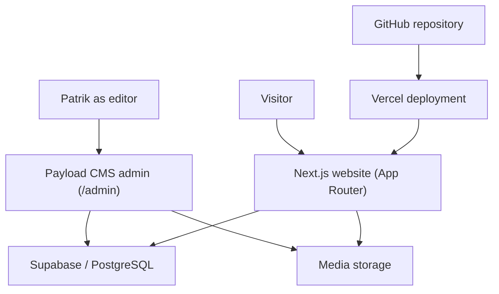
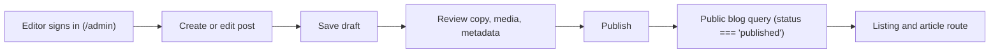
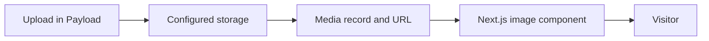
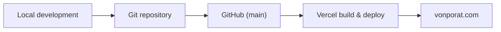

# vonporat.com — Site Architecture

Last reviewed: 2026-08-25

## Purpose

This document describes the information architecture, page responsibilities, system boundaries, content ownership, and data flow for vonporat.com.

It is an architectural map grounded in the actual codebase implementation.

- `AGENTS.md` contains mandatory agent rules and status tables.
- `PROJECT_CONTEXT.md` explains the person, identity, audience, and project meaning.
- `DESIGN_SYSTEM.md` defines visual tokens and presentation rules.
- `CONTENT_GUIDE.md` defines voice, copy, and messaging.
- `TECHNICAL_SYSTEM.md` defines technical configuration, CMS, and operations.
- The repository is authoritative for exact filenames, route implementation, package versions, scripts, schemas, and runtime behavior.

## Confidence labels

- **Established** — a durable project decision or verified live-system fact.
- **Approved** — design and copy reviewed and locked by Patrik.
- **Under review** — implemented but awaiting final user review.
- **Planned** — possible future expansion requiring explicit approval.
- **Verify in repository** — inspect the code before modifying.

## System summary

vonporat.com is a Next.js (App Router, Turbopack) application deployed on Vercel. Payload CMS provides administration and structured publishing. Supabase/PostgreSQL provides persistent data and media storage. GitHub is the version-controlled deployment source. Google Search Console and Vercel Analytics support visibility and performance review.

High-level system shape:

## Public navigation

Current implemented navigation order (in `src/components/Navbar.js`):

1. **Home** (`/`)
2. **Projects** (`/projects`)
3. **Music** (`/music`)
4. **Art** (`/art`)
5. **Blog** (`/blog`)
6. **About** (`/about`)
7. **Contact** (`/contact`)

Projects is approved and active in public navigation.

## Route map

| Route | Visibility | Status | Content source | Responsibility |
| --- | --- | --- | --- | --- |
| `/` | Public | Approved & locked | Static composition + dynamic latest blog query | Position Patrik and orient visitors through the conceptual journey. |
| `/projects` | Public | Approved & locked | Static composition | Present curated proof cards connecting creative work and systems thinking. |
| `/music` | Public | Approved & locked | Static composition | Present active music projects, verified discography, roles, and legacy bands. |
| `/art` | Public | Approved & locked | Static composition + interactive client lightbox | Present curated visual and physical practice (graphite, tattoo, miniatures, digital). |
| `/blog` | Public | Under review | Payload CMS (`posts` collection) | List published posts with category filters, dynamic lead entry, and text-led cards. |
| `/blog/[slug]` | Public (published) | Outside recent review | Payload CMS (`posts` collection) | Render individual published articles with rich text, media, and metadata. |
| `/about` | Public | Approved & locked | Static composition | Connect music, visual craft, technology, and systems into one personal narrative. |
| `/contact` | Public | Approved & locked | Static composition | Provide direct primary email action and verified external channels. |
| `/admin` | Private | Operational | Payload CMS | Authenticate editors and manage CMS collections. |

## Homepage architecture

The homepage follows the conceptual journey:
**Why → Expressions → How → Proof → Now → Journal → Contact**

Section breakdown:
1. **Hero** — Name, canonical positioning (`Guitarist, visual artist and systems-minded creator`), supporting line (`One identity. Many expressions`), and CTAs (`Explore Selected Work`, `Start a Conversation`).
2. **The Impulse (Introduction)** — Explains the single mindset across different mediums.
3. **Three Core Expressions** — `Music & Worlds` (`/music`), `Visual Practice` (`/art`), `Systems & Digital Work` (`/projects`).
4. **How I Work (Process)** — 4-stage process: `01 OBSERVE`, `02 STRUCTURE`, `03 CREATE`, `04 REFINE`.
5. **Selected Work (Proof)** — Curated cards for `Realmforged`, `Ashwrithe`, and `Visual Practice`.
6. **Current Focus (Now)** — Time-sensitive snapshots across `Music`, `Visual Art`, and `Digital & Systems`.
7. **Journal** — Dynamic query of the latest 3 published blog posts with graceful fallback.
8. **Get in Touch** — Closing exit with direct actions (`Send an Email`, `Explore More Work`).

### Homepage composition rules
- The hero establishes identity without explaining every individual discipline.
- The introduction adds context rather than repeating the hero title.
- Core expressions route visitors into deeper discipline pages.
- Selected Work provides proof rather than abstract claims.
- Current Focus remains brief, factual, and time-sensitive.
- Journal preview fails gracefully when few or no published posts exist.
- Sections remain independently maintainable without breaking page-level content ownership.

## Page architecture

### Projects (`/projects`)
Curated **Selected Work** showcase:
- **Featured Work**:
  - `Realmforged` (Active) — Music, worldbuilding, digital experience.
  - `Ashwrithe` (In Development) — Dark extreme metal, atmosphere, visual identity.
- **Supporting Work**:
  - `Visual Practice` (Ongoing Practice) — Graphite, tattoo studies, physical craft.
  - `vonporat.com` (Live · Evolving) — Creative hub platform, Next.js, Payload CMS.
  - `Systems & Improvement` (Professional Practice) — Lean Six Sigma, DMAIC, Power BI.

### Music (`/music`)
- **Current Projects**: `Realmforged` (Active) and `Ashwrithe` (In Development).
- **Selected Releases**: *Through Ash and Light* (2025), *Echoes of Betrayal* (2025), *Spiritbound* (2025).
- **Selected History**: Freternia (1998–2023) and Cromonic (2014–2017).
- **Guitar timeline**: 35+ years of guitar work and composition.

### Art (`/art`)
Curated visual and physical practice with full-screen lightbox:
- **Traditional Studies**: High-contrast graphite and charcoal studies (e.g. Eye Study).
- **Tattoo Practice**: Reelskin synthetic practice (Skull & Flow, Mario shading).
- **Miniatures & 3D Prints**: Painted resin busts (The Butcher, Conan).
- **Generative Visuals**: AI-assisted concept development and moodboards.

### About (`/about`)
Complete personal narrative connecting creative craft and analytical problem-solving:
- **Hero**: *“The work changes. The underlying impulse does not.”*
- **Background Section**: 2-column desktop composition (narrative + authentic studio portrait) with a horizontal Core Facts band underneath:
  - `Based in Sweden`
  - `Playing guitar 35+ years`
  - `Process Lean Six Sigma Green Belt`
  - `Current projects Realmforged & Ashwrithe`
- **How I Work**: *“From ambiguity to intention.”* (`Observe → Structure → Create → Refine`) with natural desktop measure.
- **Capabilities**: Contextual modes (`Music & Audio`, `Visual Practice`, `Systems & Improvement`, `Web & Digital Systems`) with tool stack.

### Contact (`/contact`)
Deliberately minimal link-exit page:
- **Hero**: `CONTACT` / `Start a conversation.`
- **Introductory copy**: Explaining collaboration across music, art, systems, and process.
- **Primary action**: Send an Email button targeting the configured `mailto:` destination.
- **Elsewhere channels**: Spotify, YouTube, Instagram, Patreon, Bandcamp, LinkedIn.
- **No contact form**: Intentionally form-free.

### Blog (`/blog` & `/blog/[slug]`)
Primary CMS-driven journal:
- **Active Categories**: `Music`, `Visual Art`, `Making`, `Technology`, `Process`, `Personal`.
- **Listing**: Lead entry (`LATEST NOTE`), dynamic category archive headings, and text-led fallback cards for posts without images.
- **Publishing boundary**: Only published posts are publicly rendered; drafts remain protected.

## Content ownership

| Content | Current owner | Storage / Source | Notes |
| --- | --- | --- | --- |
| Page layout and static copy | Repository | React components (`src/app/(app)/`) | Home, Music, Art, Projects, About, Contact. |
| Blog posts | Payload CMS | Supabase / PostgreSQL (`posts` collection) | Only published records are rendered publicly. |
| Blog media | Payload CMS | Configured storage | Uploaded via Payload admin. |
| Project logos and static imagery | Repository | `public/images/` | Optimized WebP/AVIF/SVG assets. |
| Site metadata | Repository | Next.js Metadata API | Route-specific titles, descriptions, and canonicals. |
| Social/contact channels | Repository | `src/components/ContactLinks.js` | 6 verified external destinations + email CTA. |
| Secrets and credentials | Environment | Local `.env` / Vercel Environment Variables | Never tracked in Git or Markdown. |

## CMS boundary

### Established
- Payload CMS is integrated into the Next.js App Router application.
- Supabase/PostgreSQL stores CMS data.
- Blog is the primary CMS-driven public section.
- Admin authentication protects editorial access (`/admin`).

### Static by default
- Home, Music, Art, Projects, About, and Contact.

### Planned, not automatically approved
- Bands collection
- Artwork collection
- Projects collection
- Site Settings global
- Contact Links collection

## Blog publishing flow

Expected behavior:
- Draft posts remain unavailable to normal public queries.
- Published posts appear on the blog listing and their slug route.
- Category values render consistently.
- Featured imagery resolves correctly on the first visit.
- Invalid or missing slugs return an intentional not-found state.
- Rich text renders through the approved Payload/Lexical renderer.
- Post metadata is generated from the record with sensible fallbacks.

## Media flow

Architectural expectations:
- Media records resolve to valid public URLs when content is public.
- The frontend does not generate `undefined` or incomplete media URLs.
- Above-the-fold featured images load reliably on the first visit.
- Thumbnail, card, hero, and full-view use cases serve appropriate dimensions.
- Remote image hosts are explicitly permitted by Next.js configuration when required.
- Missing media produces a deliberate fallback rather than a broken image.

## Deployment architecture

Expected workflow:
1. Inspect and test locally.
2. Review desktop and mobile behavior.
3. Run relevant repository checks (`npm run build`, `npm run lint`).
4. Review the diff.
5. Commit and push through the approved Git workflow.
6. Allow Vercel to build and deploy.
7. Verify the live route and key data paths on `vonporat.com`.

## Environment boundaries

### Local development
Used for implementation, inspection, and verification before release.

### Preview deployment
May be created by Vercel on feature branches. Verify availability and environment scope before relying on it.

### Production
The live environment serving `vonporat.com`. Production data, credentials, storage, and publishing changes require authorization.

## Rendering, caching, and revalidation

Before changing a route, identify:
- Server or client component boundary (`"use client"` vs Server Components)
- Static generation, dynamic rendering, or revalidation intervals (`revalidate = 60`)
- Payload query location (Local API on server)
- Draft/preview bypass
- Error and loading states
- Whether metadata is static or record-driven

## External services and destinations

The site links to verified destinations:
- Streaming & Music: Spotify, YouTube, Bandcamp, Patreon
- Social & Professional: Instagram, LinkedIn
- Project hubs: Realmforged (`realmforgedofficial.com`), Ashwrithe (`ashwrithe.com`)

These remain external systems. The personal site links to them without duplicating their full internal functionality.

## Failure and fallback behavior

Public routes fail deliberately and readably:
- Missing blog slug &rarr; Custom not-found screen
- Draft post requested publicly &rarr; 404 not-found
- CMS/database temporarily unavailable &rarr; Graceful fallback / static shell
- Missing featured image &rarr; Deliberate text-led card layout
- No published posts &rarr; Friendly empty-state message with reset filter

## Change-impact guide

| Change type | Inspect before implementation |
| --- | --- |
| Navigation | Header, mobile menu, active-state logic, footer, route visibility, sitemap. |
| Homepage section | Section composition, repeated copy, responsive layout, performance, destinations. |
| Blog schema | Payload collection, migration needs, queries, admin UI, rendering, metadata, existing records. |
| Media behavior | Payload Media schema, storage adapter, URL builder, Next.js config, image component, fallbacks. |
| New static page | Route conventions, metadata, navigation approval, shared layout, accessibility. |
| New CMS collection | Proven maintenance need, schema, access control, migration, queries, admin workflow, backups. |
| SEO metadata | Framework metadata implementation, canonical base, Open Graph assets, indexing, sitemap. |
| Deployment | Git state, branch, build command, environment scope, Vercel status, rollback path. |

## Repository discovery checklist

Before using this document to implement a change, verify as relevant:
- [ ] Next.js App Router directory structure (`src/app/(app)/`)
- [ ] Package scripts (`package.json`)
- [ ] Payload configuration (`payload.config.ts`) and collections (`src/collections/`)
- [ ] Database adapter (`@payloadcms/db-postgres`) and storage plugin
- [ ] Blog query and Lexical rich-text rendering code
- [ ] Published/draft access behavior
- [ ] Next.js image remote hosts configuration (`next.config.mjs` / `next.config.ts`)
- [ ] Metadata, sitemap, robots, and canonical URL implementation
- [ ] Current public navigation and route components
