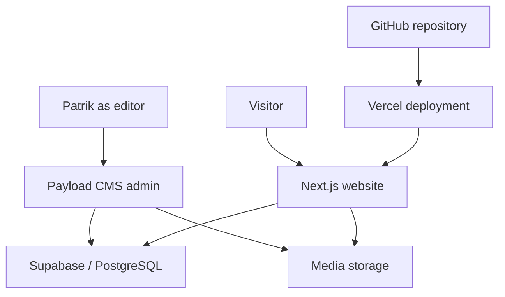
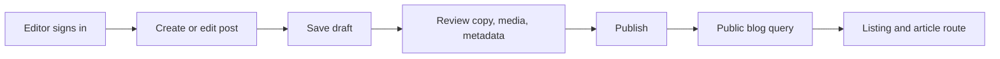
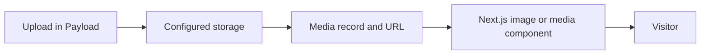
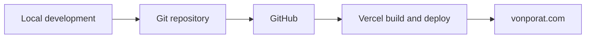

# vonporat.com — Site Architecture

Last reviewed: 2026-08-14

## Purpose

This document describes the intended information architecture, page responsibilities, system boundaries, content ownership, and high-level data flow for vonporat.com.

It is an architectural map, not a substitute for repository inspection.

- `AGENTS.md` contains mandatory agent rules.
- `PROJECT_CONTEXT.md` explains the person, identity, audience, and project meaning.
- This file explains where content and behavior belong.
- The repository is authoritative for exact filenames, route implementation, package versions, scripts, schemas, and runtime behavior.

## Confidence labels

Use these labels when interpreting this document:

- **Established** — a durable project decision or known live-system fact.
- **Intended** — approved direction that may not yet be fully implemented.
- **Planned** — a possible future expansion that still requires explicit approval.
- **Verify in repository** — do not assume the implementation detail without inspecting the code.

## System summary

vonporat.com is a Next.js application deployed on Vercel. Payload CMS provides administration and structured publishing. Supabase/PostgreSQL provides persistent data and media storage. GitHub is the version-controlled deployment source. Google Search Console and Vercel Analytics support visibility and performance review.

High-level system shape:

This diagram shows responsibility, not exact API calls or rendering mode. Verify whether each route uses Payload Local API, REST, GraphQL, server components, static generation, dynamic rendering, or another mechanism before changing it.

## Public navigation

The intended navigation order is:

1. Home
2. Music
3. Art
4. Projects
5. Blog
6. About
7. Contact

### Projects visibility

**Established:** Keep the `/projects` route and implementation available for continued development, but keep Projects hidden from public navigation until its descriptions, proof cards, images, and links are reviewed and approved.

Do not confuse “route exists” with “route is ready to promote.”

## Route map

| Route | Visibility | Content source | Responsibility |
| --- | --- | --- | --- |
| `/` | Public | Primarily static composition; may include selected dynamic content | Position Patrik and direct visitors to the strongest work. |
| `/music` | Public | Static unless specifically migrated | Present active music projects, selected releases, roles, and legacy context. |
| `/art` | Public | Static unless specifically migrated | Present a curated selection of visual and physical work. |
| `/projects` | Route retained; navigation hidden | Static unless specifically migrated | Present real proof cards and project cases. |
| `/blog` | Public | Payload CMS | List published posts with useful categories, excerpts, dates, and imagery. |
| `/blog/[slug]` | Public for published content | Payload CMS | Render one complete published article with correct media and metadata. |
| `/about` | Public | Static unless specifically migrated | Explain Patrik's full creative and systems-oriented identity. |
| `/contact` | Public | Static unless specifically migrated | Provide essential contact and external destinations. |
| Payload admin route | Private/admin | Payload CMS | Authenticate editors and manage approved CMS content. Verify the exact path. |
| Authentication or service routes | Non-public unless explicitly designed otherwise | Application configuration | Support admin, CMS, storage, and integrations. Never expose through public navigation by accident. |

Verify the actual route tree before adding, renaming, redirecting, or deleting routes.

## Homepage architecture

The homepage is an entry point and summary, not a duplicate of every other page.

Intended section order:

1. **Hero** — concise identity and primary action
2. **Short introduction** — connect music, images, digital systems, and structured problem-solving
3. **Creative pillars** — Music, Visual Art, Projects, and Writing
4. **Selected Work / Proof Cards** — four to six concrete examples
5. **Creative Operating System** — capabilities presented as ways of working
6. **Process** — Observe → Structure → Create → Refine
7. **Now / Current Focus** — a short, changeable snapshot
8. **Latest from the Blog** — only current and strong content
9. **Contact / Link exit** — a restrained final path

### Homepage composition rules

- The hero should establish identity, not explain every discipline.
- The introduction should add meaning rather than repeat the hero.
- Creative pillars should route visitors into deeper sections.
- Selected Work should provide proof, not more abstract positioning.
- Current Focus should be easy to update and remain brief.
- Latest Blog should fail gracefully when there are few or no published posts.
- Sections should remain removable or reorderable without breaking page-level content ownership.

## Page architecture

### Music

Primary content groups:

1. Active projects
2. Selected releases or listening destinations
3. Patrik's role and relevant project context
4. Selected legacy work

Realmforged and Ashwrithe are active priorities. Freternia, Cromonic, and other relevant history provide depth but should remain visually secondary.

Music project identities remain independent. The personal site can frame them consistently without merging their copy, genre language, colors, or visual systems.

### Art

Intended content groups:

- Graphite
- Tattoo Practice
- Generative Visuals
- Miniatures & 3D Printing

The Art page is a curated gallery and contextual overview. It should not depend on publishing every asset Patrik owns.

Future individual artwork records may support richer galleries, but the approved current boundary is static content until a migration is explicitly requested.

### Projects

Initial proof-card set:

- vonporat.com
- Realmforged
- Ashwrithe
- Graphite Practice
- Tattoo Practice
- Power BI / Process Improvement

Each item needs:

- Title
- Category or discipline
- Short overview
- Reason the project exists
- Patrik's role
- Current status or result
- Relevant tags or technologies
- Image or screenshot
- A valid continuation path when one exists

Do not reveal Projects in navigation until this set is accurate enough to create trust.

### Blog

Blog is the primary CMS-driven public section.

Expected post-level data:

- Title
- Slug
- Publish date
- Excerpt
- Cover or hero image
- Rich-text body
- Category
- Tags
- Draft/published status
- SEO title
- Meta description
- Open Graph image or suitable fallback

Verify the actual Payload Posts schema before reading, writing, renaming, or migrating fields.

### About

About owns the complete personal narrative. The homepage may preview it, but should not duplicate it.

Expected content areas:

- Whole identity
- Musical background
- Active music projects
- Visual and physical practice
- Technology and AI-assisted workflows
- Lean Six Sigma, Power BI, and systems thinking
- Observe → Structure → Create → Refine
- Discreet Tool Stack
- Contact path

### Contact

Contact owns the concise collaboration and link-exit experience.

Expected content:

- One short introductory paragraph
- Essential contact method
- Selected social and project destinations
- Clear accessible labels

Contact should not become another full profile page.

## Content ownership

| Content | Current owner | Notes |
| --- | --- | --- |
| Page layout and static copy | Repository | Home, Music, Art, Projects, About, and Contact remain static by default. |
| Blog posts | Payload CMS | Only published content should be publicly rendered. |
| Blog media | Payload media configuration / Supabase storage | Verify collection and storage-adapter details. |
| Project logos and static imagery | Repository or configured media source | Verify each asset before moving or duplicating it. |
| Site-wide metadata | Repository and/or framework metadata configuration | A future Site Settings collection is not approved by default. |
| Social/contact destinations | Repository | A future Contact Links collection remains planned. |
| Secrets and credentials | Approved environment-variable stores | Never store values in Markdown, source, or CMS content. |

Avoid creating two editable sources for the same public value unless synchronization behavior is explicitly designed.

## Current CMS boundary

### Established

- Payload CMS is integrated into the Next.js project.
- Supabase/PostgreSQL provides persistent CMS data.
- Blog is the primary CMS-driven public section.
- Media is served through the configured storage system.
- Admin authentication protects editorial access.

### Static by default

- Home composition and primary copy
- Music
- Art
- Projects
- About
- Contact

### Planned, not automatically approved

- Bands collection
- Artwork collection
- Projects collection
- Site Settings global or collection
- Contact Links collection
- Custom analytics dashboard inside Payload

The existence of a plan in documentation does not authorize implementation.

## Blog publishing flow

Intended flow:

Expected behavior:

- Draft posts remain unavailable to normal public queries.
- Published posts appear on the blog listing and their slug route.
- Category and tag values render consistently.
- Featured imagery resolves correctly on the first visit.
- Invalid or missing slugs return an intentional not-found state.
- Rich text renders through the approved Payload/Lexical renderer.
- Post metadata is generated from the record with sensible fallbacks.

Verify hooks, access rules, preview behavior, caching, and revalidation in the repository before modifying the publishing flow.

## Media flow

Intended responsibility:

Architectural expectations:

- Media records should resolve to valid public URLs when content is public.
- The frontend should not generate `undefined` or incomplete media URLs.
- Above-the-fold featured images should load reliably on the first visit.
- Thumbnail, card, hero, and full-view use cases should not all serve the same oversized asset.
- Remote image hosts must be explicitly permitted by Next.js configuration when required.
- Missing media should produce a deliberate fallback rather than a broken image.

Verify storage adapter, bucket visibility, URL transformation, image optimization, and Payload media field structure before changing media logic.

## Deployment architecture

Established deployment relationship:

Expected workflow:

1. Inspect and test locally.
2. Review desktop and mobile behavior.
3. Run relevant repository checks.
4. Review the diff.
5. Commit and push through the approved Git workflow.
6. Allow Vercel to build and deploy.
7. Verify the live route and key data paths.

Do not assume that every push targets production. Verify branches, Vercel project configuration, environment scope, and deployment rules before release work.

## Environment boundaries

### Local development

Used for implementation, inspection, experimentation, and verification before release.

### Preview deployment

May be created by Vercel depending on repository configuration. Verify availability and authentication before relying on it.

### Production

The live environment serving vonporat.com. Production data, credentials, storage, and publishing changes require extra care.

Environment-variable names may be documented when useful, but secret values must remain outside the repository and documentation.

## Rendering, caching, and revalidation

Do not assume a single rendering strategy for the whole site.

Before changing a route, identify:

- Server or client component boundary
- Static, dynamic, or revalidated rendering behavior
- Payload query location
- Cache and revalidation behavior
- Draft/preview implications
- Error and loading states
- Whether metadata is static or record-driven

When CMS content appears stale, inspect caching and revalidation before adding redundant client-side fetching.

## External services and destinations

The site may link to or embed selected destinations such as:

- Spotify
- YouTube
- Instagram
- Facebook
- Bandcamp
- Patreon
- LinkedIn
- Realmforged's website
- Ashwrithe's website

These remain external systems. The personal site should link or embed them intentionally without trying to duplicate their full functionality.

Verify current URLs and ownership before publishing or changing external destinations.

## Failure and fallback behavior

Public routes should fail deliberately and readably.

Important cases:

- Missing blog slug
- Draft post requested publicly
- Missing or malformed media
- CMS/database temporarily unavailable
- External embed blocked or unavailable
- Empty latest-post result
- Invalid external link
- Deployment with missing environment configuration

Do not expose stack traces, secret values, raw database errors, internal record structures, or admin implementation details to visitors.

## Change-impact guide

| Change type | Inspect before implementation |
| --- | --- |
| Navigation | Header, mobile menu, active-state logic, footer, route visibility, sitemap. |
| Homepage section | Section composition, repeated copy, responsive layout, performance, destinations. |
| Blog schema | Payload collection, migration needs, queries, admin UI, rendering, metadata, existing records. |
| Media behavior | Payload Media schema, storage adapter, URL builder, Next.js config, image component, fallbacks. |
| New static page | Route conventions, metadata, navigation approval, shared layout, accessibility. |
| New CMS collection | Proven maintenance need, schema, access control, migration, queries, admin workflow, backups. |
| SEO metadata | Framework metadata implementation, canonical base, Open Graph assets, indexing, sitemap. |
| Deployment | Git state, branch, build command, environment scope, Vercel status, rollback path. |

## Repository discovery checklist

Before using this document to implement a change, verify as relevant:

- [ ] Actual Next.js application directory and routing convention
- [ ] Package manager and lockfile
- [ ] Available lint, type-check, test, and build scripts
- [ ] Payload configuration file and installed version
- [ ] Posts, Media, and Users collection definitions
- [ ] Database and storage adapters
- [ ] Blog query and rich-text rendering code
- [ ] Published/draft access behavior
- [ ] Next.js image-host configuration
- [ ] Metadata, sitemap, robots, and canonical implementation
- [ ] Vercel deployment configuration
- [ ] Current public navigation and Projects visibility
- [ ] Existing tests and preview workflow

## Architecture maintenance

Update this document when one of these changes materially:

- A public route is added, removed, renamed, or changes responsibility.
- Navigation visibility or order changes.
- Content moves between repository and CMS ownership.
- A planned collection becomes approved and implemented.
- The database, media, deployment, or authentication architecture changes.
- Blog publishing, preview, cache, or revalidation behavior changes.
- A new external system becomes structurally important.

Do not update this document for ordinary copy edits, individual posts, visual polish, or isolated bug fixes that do not change system responsibility.
