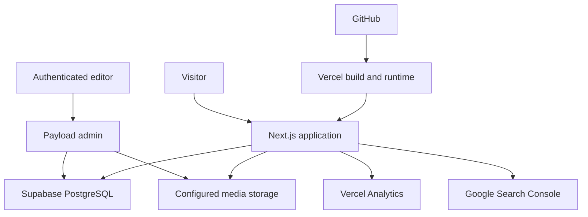
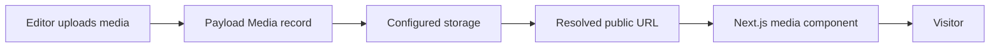

# vonporat.com — Technical System

Last reviewed: 2026-08-14

## Purpose

This document describes the known technical system behind vonporat.com and the procedures an AI agent should follow when inspecting, changing, testing, deploying, or troubleshooting it.

It intentionally does not hard-code unverified package versions, paths, commands, schemas, branch names, or environment-variable names.

- `AGENTS.md` contains mandatory project rules.
- `SITE_ARCHITECTURE.md` defines routes, responsibilities, and content ownership.
- This file defines technical boundaries, discovery procedures, safe workflows, and operational expectations.
- The repository and configured services are authoritative for their current implementation.

## Confidence model

Interpret technical statements using these labels:

- **Established** — known current architecture or durable project decision.
- **Expected** — intended behavior that must be confirmed in code and runtime.
- **Planned** — possible future work that is not approved by default.
- **Repository-specific** — never infer; inspect the current project.

## Established platform

| Layer | Technology | Responsibility |
| --- | --- | --- |
| Web application | Next.js | Public pages, routing, rendering, components, metadata, and frontend behavior. |
| Content management | Payload CMS | Admin authentication, collections, rich-text editing, publishing, and media records. |
| Persistent database | Supabase / PostgreSQL | Payload content and application data. |
| Media storage | Configured Supabase/S3-compatible storage | Uploaded blog and CMS media. Verify the active adapter and bucket configuration. |
| Source control | GitHub | Version history and source used by the deployment workflow. |
| Hosting | Vercel | Builds, deployments, domain delivery, runtime configuration, and analytics. |
| Search visibility | Google Search Console | Indexing and search-performance review. |
| Content editor | Payload admin | Private interface used by Patrik to manage approved CMS content. |

The live public domain is `vonporat.com`.

## System relationship

The diagram shows responsibility, not an exact request path. Confirm whether content is accessed with Payload Local API, REST, GraphQL, direct server integration, or another supported mechanism before editing queries.

## Repository is the source of truth

Before technical work, inspect rather than assume:

- Repository root and active Git worktree
- Package manager and lockfile
- Node.js version requirements
- Next.js and Payload versions
- TypeScript or JavaScript configuration
- Application and route directory structure
- Payload configuration location
- Collection and global definitions
- Database adapter
- Storage adapter and media URL behavior
- Environment-variable names
- Existing scripts
- Test framework and coverage
- Linting and formatting tools
- Deployment branches and Vercel configuration
- Cache and revalidation behavior
- Authentication and access-control implementation

Documentation describes intent. Code, migrations, configuration, and runtime behavior describe the current system.

## Initial repository discovery

Use a focused inspection sequence:

1. Read `AGENTS.md` and relevant `docs/ai/` files.
2. Inspect Git status and preserve unrelated changes.
3. Identify the package manager from the lockfile.
4. Read `package.json` scripts and dependencies.
5. Inspect framework and TypeScript configuration.
6. Locate the Next.js route tree.
7. Locate Payload configuration, collections, globals, access rules, hooks, and migrations.
8. Locate database and storage-adapter configuration.
9. Locate blog queries, rich-text rendering, media URL resolution, and metadata generation.
10. Locate existing tests and deployment configuration.

Do not scan or print secret files to discover configuration. Inspect variable names and usage without exposing values.

## Content ownership boundary

### CMS-driven

**Established:** Blog is the primary CMS-driven public section.

Expected CMS-managed content includes:

- Blog posts
- Blog cover images
- Blog rich text
- Categories and tags supported by the current schema
- Draft/published status
- Post-specific SEO fields when implemented

### Static by default

The following remain repository-managed unless Patrik approves a specific migration:

- Homepage composition and core copy
- Music
- Art
- Projects
- About
- Contact

Do not introduce dual ownership where the same value can be edited in both code and CMS without an explicit synchronization design.

### Planned, not approved by default

- Bands collection
- Artwork collection
- Projects collection
- Site Settings global or collection
- Contact Links collection
- Custom analytics dashboard inside Payload

A mention in a roadmap does not authorize implementation.

## Known public routes

Expected public routes include:

- `/`
- `/music`
- `/art`
- `/projects`
- `/blog`
- `/blog/[slug]`
- `/about`
- `/contact`

The Projects route may exist but must remain hidden from public navigation until its content is approved.

Verify the actual route tree, redirects, not-found behavior, sitemap entries, and indexing configuration before changing routes.

## Private and administrative boundaries

Payload admin, authentication endpoints, internal tooling, service routes, and environment-dependent utilities must not become publicly discoverable through normal navigation.

Before changing admin or authentication behavior, inspect:

- Admin route configuration
- User collection and authentication settings
- Access-control functions
- Session and cookie configuration
- CSRF and allowed-origin settings
- Server-only imports
- Public versus private environment variables
- Preview and draft behavior

Never solve an admin-access problem by removing authentication or weakening authorization.

## Payload CMS

### Expected responsibilities

Payload is responsible for:

- Authenticated administration
- Collection schemas
- Content validation
- Draft and published state
- Rich-text editing
- Media records
- Hooks and generated slugs where configured
- Database persistence through the configured adapter
- Access control

### Verify before changing Payload

- Exact Payload version
- Configuration syntax used by that version
- Database adapter and pool behavior
- Lexical editor configuration
- Collection slugs and TypeScript types
- Generated type workflow
- Migrations and migration commands
- Access rules
- Hooks
- Admin import map or generated files
- Storage plugin configuration
- Production build integration

Use the installed version's APIs. Do not copy configuration from a different major version without verification.

## Posts content model

The intended Posts model includes these concepts:

| Concept | Expected purpose |
| --- | --- |
| Title | Public article title. |
| Slug | Stable public route identifier. |
| Publish date | Ordering and public date. |
| Cover image | Listing and article imagery. |
| Excerpt | Concise listing and sharing summary. |
| Body | Lexical rich-text content. |
| Category | Controlled high-level editorial grouping. |
| Tags | Narrower subjects and cross-linking. |
| Status | Draft or published behavior. |
| SEO title | Optional search title override. |
| Meta description | Search and sharing summary. |
| Open Graph image | Optional social-image override or fallback. |

This is an intended conceptual model. Fetch and inspect the actual collection before using field names or adding migrations.

### Category set

The preferred category set is:

- Behind the Scenes
- Music
- Visual Art
- Process & Systems
- Tools & Experiments
- Personal

Confirm how categories are represented before changing them: select field, relationship, collection, localized value, or another structure.

## Blog query behavior

Expected public behavior:

- List only published posts.
- Order posts predictably, normally by publish date.
- Resolve cover imagery on first visit.
- Link each item to a stable slug route.
- Render excerpts, dates, and categories consistently.
- Return an intentional empty state when no posts match.
- Return a deliberate not-found result for invalid or unavailable slugs.
- Avoid exposing draft records through public queries or metadata.

Before modifying queries, inspect:

- Payload Local API, REST, or GraphQL usage
- Server/client boundary
- Depth and relationship population
- Pagination
- Draft flag behavior
- Access override behavior
- Cache and revalidation
- Error handling
- Type safety

Do not add a second fetching method merely to bypass an unresolved problem in the current one.

## Rich-text rendering

Blog bodies use or are intended to use Payload's Lexical rich text.

The renderer should support the nodes actually enabled in the editor, which may include:

- Paragraphs
- Headings
- Lists
- Links
- Quotes
- Images or uploads
- Inline formatting
- Code, embeds, or custom blocks when configured

Verify the editor feature set and stored content before changing the renderer. An editor/renderer mismatch can make existing content disappear or render incorrectly.

Rich-text output must:

- Use safe rendering paths
- Preserve heading hierarchy
- Apply intentional long-form typography
- Keep media responsive
- Prevent overflow
- Handle missing or legacy nodes deliberately
- Avoid injecting unsanitized arbitrary HTML

## Media system

### Expected media flow

### Known requirements

- Featured images must load reliably on the first visit.
- The frontend must not build `undefined`, incomplete, or duplicated media URLs.
- Public media needs a valid accessible URL.
- Remote hosts must be allowed by current Next.js image configuration when required.
- Media should have deliberate fallbacks.
- Image dimensions should be reserved to reduce layout shift.
- Thumbnail, card, hero, and full-view use cases should use appropriate sizes.

### Verify before changing media

- Media collection schema
- Storage adapter
- Bucket and endpoint configuration
- Public/private access policy
- URL returned by Payload
- Whether URLs are absolute or relative
- Image sizes generated by Payload
- Next.js `remotePatterns` or equivalent configuration
- Image-component loader behavior
- Cache headers
- Existing media records
- Migration implications

Do not make a private bucket public or disable policy enforcement as a shortcut without explicit authorization and a security review.

## Supabase and PostgreSQL

Supabase/PostgreSQL stores Payload data and supports configured media infrastructure.

Before database work, identify:

- Active database adapter
- Connection pooling strategy
- Direct versus pooled production connection
- Migration state
- Table ownership and naming
- Payload-generated database schema
- Extension requirements
- Backup and restore capability
- Environment separation
- Storage policies when relevant

### Database-change rules

- Prefer Payload-supported schema changes and migrations.
- Review generated or handwritten migrations before execution.
- Understand whether a migration is reversible.
- Back up material production data before a destructive migration.
- Never run destructive database commands against an unverified target.
- Do not edit production tables manually to avoid correcting a schema or migration problem.
- Do not expose database connection strings in logs or documentation.

## Environment variables and secrets

Secrets belong in approved local and Vercel environment-variable stores and a password manager.

Never store values in:

- Git-tracked files
- Markdown documentation
- Notion
- Source comments
- Screenshots
- Test fixtures
- Error messages
- Build logs
- AI prompts or generated examples

Sensitive classes include:

- Database passwords and connection strings
- Payload secrets
- Supabase service credentials
- S3-compatible access and secret keys
- OAuth client secrets
- Private API tokens

### Safe inspection

- Inspect variable names and call sites.
- Confirm that required variables exist without printing their values.
- Redact URLs that embed credentials.
- Distinguish server-only variables from public browser-exposed variables.
- Verify environment scope: development, preview, or production.

### If a secret is found in tracked content

1. Do not repeat the value.
2. Identify the affected file or system.
3. Treat the value as exposed.
4. Rotate it in the provider.
5. Update approved environment stores.
6. Verify application behavior.
7. Remove the exposed value from current content.
8. Consider repository-history cleanup only with explicit authorization and a coordinated plan.

## Local development

Repository-specific commands must be read from the current project.

Expected workflow:

1. Confirm working directory and Git status.
2. Use the package manager associated with the lockfile.
3. Install dependencies only when needed and through the existing workflow.
4. Confirm required environment-variable names.
5. Run the documented development script.
6. Inspect the relevant public route and Payload admin behavior.
7. Make a focused change.
8. Run relevant checks.
9. Review desktop and mobile behavior.
10. Review the diff before handoff.

Do not guess `npm`, `pnpm`, `yarn`, or `bun`; inspect the repository.

## Build and verification commands

Do not hard-code commands in this document until verified from `package.json` and repository tooling.

Identify and run, as relevant:

- Lint
- Type check
- Unit tests
- Integration tests
- End-to-end tests
- Production build
- Payload type generation
- Payload import-map generation
- Database migration status
- Formatting check

If a relevant command does not exist, report that fact. Do not claim a check passed when it was not available or not run.

## Git workflow

Before editing:

- Inspect branch and status.
- Identify unrelated user changes.
- Avoid modifying unrelated files.
- Do not reset or discard work without authorization.

Before committing or handing off:

- Review the full diff.
- Check for accidental generated-file churn.
- Check for secrets.
- Confirm only intended files changed.
- Run relevant checks.
- Summarize verification and remaining risk.

Do not push, merge, rewrite history, create a pull request, or deploy unless the user's request authorizes that action.

## Vercel deployment

Vercel builds and serves the live site.

Verify before deployment work:

- Connected Vercel project
- Git repository and branch mapping
- Production branch
- Preview-deployment behavior
- Root directory
- Build command
- Output/runtime configuration
- Environment-variable scope
- Domain configuration
- Function and build logs
- Current deployment status

### Safe release flow

1. Complete local implementation and verification.
2. Run the production build locally when feasible.
3. Review the diff and migration implications.
4. Push through the approved Git workflow.
5. Observe the Vercel build result.
6. Verify the changed route on the deployed environment.
7. Verify CMS and media behavior when affected.
8. Check mobile behavior and basic performance.
9. Record or report any follow-up.

Do not describe a deployment as successful based only on a successful Git push.

## Analytics and search tooling

### Vercel Analytics

Vercel Analytics is active and is the primary existing source for basic web-usage and performance signals.

Do not build a duplicate Payload analytics dashboard without an approved decision and a concrete recurring use case.

### Google Search Console

Google Search Console is connected for indexing and search-performance review.

Changes affecting routes, canonicals, metadata, sitemaps, robots directives, structured data, or redirects should consider Search Console implications.

Never publish verification tokens or private account data unnecessarily.

## SEO technical system

Inspect the current implementation of:

- Metadata API or page metadata
- Metadata base
- Canonical URLs
- Open Graph and social images
- Sitemap
- Robots configuration
- Not-found pages
- Redirects
- Index/noindex behavior
- Structured data, if present

For CMS-driven posts, metadata should use the post record with sensible fallbacks. Draft and private content must not appear in public metadata or sitemaps.

## Performance baseline

Mobile performance is part of system quality.

Known pressure points have included:

- Large hero assets
- Large avatar assets
- Image-heavy Music and Art pages
- Oversized thumbnails
- Photographic PNG files
- Blur and backdrop filters
- Large shadows
- Continuous animations
- Layout shift from media without dimensions

Previous optimization work showed that major asset-size reductions are possible without changing the design. Treat asset selection and delivery as part of implementation, not a cleanup after design is complete.

### Performance workflow

1. Measure before changing.
2. Identify the largest transferred assets and costly visual effects.
3. Separate network, rendering, JavaScript, and interaction issues.
4. Apply the smallest high-impact fix.
5. Rebuild and measure again.
6. Verify visual quality.
7. Verify mobile behavior.

### Image requirements

- Use responsive dimensions.
- Prefer WebP or AVIF for suitable photographic content.
- Preserve transparent formats only when transparency is needed.
- Avoid serving full-resolution assets as thumbnails.
- Lazy-load below-the-fold imagery.
- Prioritize only genuine above-the-fold media.
- Reserve dimensions.
- Avoid replacing a working optimized image with a heavier source during redesign.

## Caching and revalidation

Repository-specific cache behavior must be inspected.

Before changing fetching or fixing stale CMS content, determine:

- Rendering mode for the route
- Next.js fetch cache behavior
- Payload query behavior
- Revalidation interval or tags
- Dynamic-route generation
- Draft/preview bypass
- Vercel cache behavior
- Whether publishing triggers a webhook or revalidation action

Do not add client-side polling or disable all caching before understanding the stale-data path.

## Error handling and observability

Public errors should be useful without exposing internals.

Handle deliberately:

- Missing post
- Draft post requested publicly
- CMS query failure
- Database connection failure
- Missing media
- Invalid media URL
- External embed failure
- Missing environment configuration
- Deployment/build failure

### Logs

Logs may include:

- Stable error category
- A safe contextual identifier
- Route or operation
- Timestamp supplied by the platform
- Redacted provider response where useful

Logs must not include:

- Secret values
- Credential-bearing URLs
- Full environment dumps
- Sensitive personal data
- Complete database records without need
- Raw authentication tokens or cookies

## Troubleshooting order

Use this sequence unless evidence points elsewhere:

1. Reproduce the issue and identify the affected environment.
2. Check recent code and content changes.
3. Inspect browser/network behavior when relevant.
4. Inspect application and Vercel logs with secrets redacted.
5. Confirm environment-variable presence and scope without printing values.
6. Verify Payload query and access behavior.
7. Verify database connectivity and migration state.
8. Verify media record, URL, storage, and Next.js host configuration.
9. Inspect cache and revalidation.
10. Apply a small reversible fix and rerun relevant checks.

Avoid broad reinstallations, dependency upgrades, schema rewrites, or cache disabling as first responses.

## Common diagnostic paths

### Blog post missing

Check:

- Record exists
- Published/draft state
- Slug value
- Public access rule
- Query filters
- Cache/revalidation
- Route not-found logic

### Featured image broken

Check:

- Relationship populated at expected depth
- Media record exists
- URL field shape
- Absolute/relative URL handling
- Storage access
- Next.js remote-host permission
- Image fallback
- First-load versus client-navigation behavior

### Payload admin unavailable

Check:

- Build succeeded
- Admin route configuration
- Required server environment variables
- Database connectivity
- User authentication
- Payload-generated artifacts
- Server logs

Do not expose or weaken the admin route as a workaround.

### Production build fails

Check:

- First relevant error rather than final cascade
- Node and dependency versions
- Generated Payload files
- Type errors
- Missing environment-variable names
- Server/client import boundary
- Migration or database access occurring during build
- Remote asset assumptions

### Site feels slow on mobile

Check:

- Largest images and formats
- Hero and avatar loading
- Music and Art media
- Font loading
- Blur/backdrop-filter count
- Animation loops
- Main-thread JavaScript
- Layout shift
- Hydration and client-component scope

## Dependency policy

Before adding a production dependency:

1. Confirm the problem cannot be solved clearly with the existing stack.
2. Inspect repository conventions.
3. Evaluate bundle and maintenance cost.
4. Check compatibility with installed Next.js and Payload versions.
5. Obtain explicit approval when the dependency changes architecture or production footprint.

Do not upgrade major framework versions as incidental work.

## Migration policy

A migration is required when a persistent schema change demands it under the active Payload/database workflow.

Before migration:

- Inspect existing migrations.
- Confirm target environment.
- Understand generated SQL or operations.
- Identify data-loss risk.
- Plan backup and rollback.
- Test against a safe environment when feasible.

After migration:

- Confirm application startup.
- Confirm Payload admin behavior.
- Confirm existing content.
- Confirm public routes.
- Record the schema change.

Never run a destructive production migration merely because local development appears successful.

## Backup and recovery

Verify actual backup mechanisms before relying on them.

Recovery planning should cover:

- Git history for source code
- Vercel deployment rollback for application releases
- PostgreSQL backups for CMS data
- Media-storage retention and recovery
- Credential rotation
- DNS and domain ownership

Do not claim a backup exists without verifying its current availability, retention, and restore path.

## External links and integrations

The public site may link to Spotify, YouTube, Instagram, Facebook, Bandcamp, Patreon, LinkedIn, Realmforged, and Ashwrithe.

Verify external URLs before publishing them. Treat embedded players and third-party scripts as performance, privacy, accessibility, and failure-state decisions.

Do not add third-party tracking or embeds without a clear visitor benefit and appropriate review.

## Backend control-room concept

Patrik has considered a private backend-only control room containing administrative links to services such as:

- Vercel
- Google Search Console
- Supabase
- Payload
- GitHub
- DNS/domain management

This concept must remain private and must not alter the public frontend unless explicitly requested. A list of safe external admin destinations is different from storing credentials. Never put secrets into such a page.

## Technical definition of done

A technical change is complete when:

- The requested behavior is implemented.
- Relevant repository rules were followed.
- Existing architecture and content boundaries remain intact unless change was approved.
- Relevant lint, type, test, generation, migration, and build checks pass, or unavailable checks are reported.
- Desktop and mobile behavior are verified when public UI is affected.
- Draft, admin, and private boundaries remain protected.
- No secrets are exposed.
- Performance impact is considered.
- The diff contains no unrelated changes.
- Deployment is verified when deployment was part of the request.
- Durable architectural changes are documented.

## Technical handoff format

When reporting completed work, include:

1. **Outcome** — what now works or changed.
2. **Files** — main files changed.
3. **Verification** — commands and manual checks actually run.
4. **Data or migration impact** — if any.
5. **Deployment state** — local, preview, or production.
6. **Remaining risk** — only concrete unresolved issues.

Do not claim tests, builds, deployments, migrations, or live verification that did not occur.

## Maintenance of this document

Update this file when one of the following changes materially:

- Framework or CMS architecture
- Database or storage adapter
- Public/CMS content boundary
- Authentication or access-control model
- Posts or Media conceptual model
- Build or deployment workflow
- Environment strategy
- Cache and revalidation behavior
- Analytics or search integration
- Backup or recovery approach
- A recurring technical failure becomes a documented diagnostic path

Do not update it for ordinary copy edits, individual posts, visual polish, or isolated bug fixes that do not alter system responsibility.
