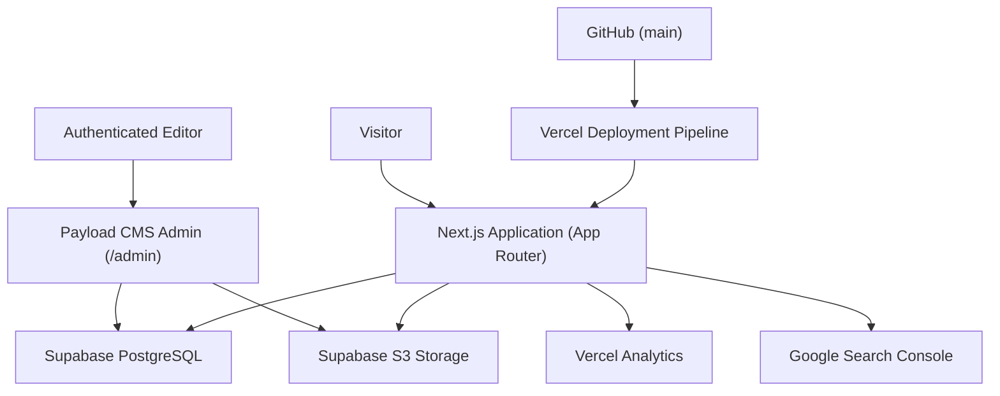
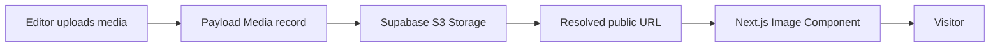

# vonporat.com — Technical System

Last reviewed: 2026-08-25

## Purpose

This document describes the technical architecture, operational boundaries, diagnostics, and development procedures for vonporat.com.

It is grounded in the actual codebase implementation and package configuration.

- `AGENTS.md` contains mandatory rules and current page statuses.
- `SITE_ARCHITECTURE.md` defines routes, page responsibilities, and content ownership.
- `QUALITY_STANDARDS.md` defines QA and verification workflows.
- The repository is authoritative for exact dependencies, file paths, scripts, and runtime behavior.

## Platform overview

| Layer | Technology | Details |
| --- | --- | --- |
| Frontend framework | Next.js 16.2.6 | App Router, Turbopack, React 19.2.4 |
| CMS engine | Payload CMS v3.85+ | Lexical rich-text editor, Postgres adapter, Local API |
| Database | Supabase / PostgreSQL | Persistent data storage for Payload CMS collections |
| Media storage | S3-compatible Supabase Storage | Payload `@payloadcms/storage-s3` plugin |
| Styling | Tailwind CSS v4 | PostCSS plugin, CSS theme variables |
| Hosting & Analytics | Vercel | Automatic deployments on `main`, Vercel Analytics, Speed Insights |
| Source control | GitHub | `xvonpat/patrik-von-porat-portfolio` |
| Search performance | Google Search Console | Indexing, sitemap, and canonical URL monitoring |

## System relationship



## Repository is authoritative

Before performing technical work, inspect the repository rather than relying on assumptions:
- Package manager and lockfile (`package-lock.json` &rarr; `npm`)
- Next.js and Payload versions in `package.json`
- Next.js route tree in `src/app/(app)/`
- Payload configuration in `payload.config.ts` and collections in `src/collections/`
- Database and storage adapter configurations
- Environment-variable names in `.env` and call sites
- Available scripts in `package.json`

## Content ownership boundary

### CMS-driven (Payload CMS)
- **`posts` collection**: Blog articles, titles, slugs, excerpts, rich-text body, categories, published status, publish dates, and cover media.
- **`media` collection**: Uploaded images and media records.
- **`users` collection**: Authenticated administrative users.

### Repository-managed (Static code)
- Homepage structure and copy (`src/app/(app)/page.js`)
- Projects page (`src/app/(app)/projects/page.js`)
- Music page (`src/app/(app)/music/page.js`)
- Art page and client lightbox (`src/app/(app)/art/`)
- About page (`src/app/(app)/about/page.js`)
- Contact page (`src/app/(app)/contact/page.js`, `src/components/ContactLinks.js`)
- Navigation and Footer components (`src/components/`)
- Static assets and logos (`public/images/`)

Do not introduce dual ownership where the same value can be edited in both code and CMS without an explicit synchronization design.

## Public routes & navigation

Current implemented navigation order (in `src/components/Navbar.js`):

```text
Home (/) · Projects (/projects) · Music (/music) · Art (/art) · Blog (/blog) · About (/about) · Contact (/contact)
```

Verified public routes:
- `/` — Homepage (static composition + dynamic latest blog query)
- `/projects` — Selected Work proof cards (static composition)
- `/music` — Projects, discography, and legacy bands (static composition)
- `/art` — Visual craft showcases and interactive lightbox (static + client gallery)
- `/blog` — Journal listing (Payload CMS `posts` collection)
- `/blog/[slug]` — Individual article reader (Payload CMS `posts` collection)
- `/about` — Personal narrative, studio portrait, core facts (static composition)
- `/contact` — Email CTA and external channels (static composition)

## Private and administrative boundaries

- `/admin` — Private Payload CMS administration panel protected by authentication.
- Authentication endpoints, service routes, and database credentials must never be exposed publicly.
- Never weaken access control or authentication to simplify implementation.

## Payload CMS configuration

### Collection schema: `posts`
The `posts` collection (`src/collections/Posts.ts`) defines:

| Field | Type | Purpose |
| --- | --- | --- |
| `title` | Text | Article title (required). |
| `slug` | Text | Route slug; auto-generated from title if empty. |
| `category` | Select | Active categories: `music`, `visual-art`, `technology`, `process`, `personal`. |
| `publishedDate` | Date | Publication date; auto-set to current time when published if empty. |
| `tags` | Array | Topic tags; auto-suggested from keywords if empty. |
| `status` | Select | `draft` or `published`. |
| `featured` | Checkbox | Featured status for editorial prioritization. |
| `featuredImage` | Upload | Relationship to `media` collection. |
| `excerpt` | Textarea | Summary; auto-generated from first paragraph if empty. |
| `content` | RichText | Lexical rich-text body. |
| `seo` | Group | `seoTitle`, `metaDescription`, `ogImage`, and `canonicalUrl` (auto-populated with fallbacks). |

### Blog query behavior
- Public queries query only published posts (`where: { status: { equals: 'published' } }`).
- Draft posts remain private and are excluded from public sitemaps and listings.
- Featured images resolve to populated media URLs.
- Missing posts or invalid slugs trigger a custom not-found state.

### Lexical rich-text rendering
- Blog bodies use Payload's Lexical editor.
- The frontend renderer handles standard nodes: headings (`h1`–`h4`), paragraphs, lists (ordered/unordered), blockquotes, links, and embedded images.
- Content inherits typography styles defined in the design system.

## Media pipeline



Requirements:
- Featured images resolve reliably on first load.
- Images use appropriate modern formats (WebP, AVIF, SVG, PNG where transparency is required).
- Reserved dimensions prevent unexpected layout shift.
- Media fallbacks ensure posts without featured images render clean text-led layouts.

## Supabase and PostgreSQL

- Connection string configured via environment variables.
- Uses `@payloadcms/db-postgres` adapter with connection pooling.
- Backups and data integrity are managed through Supabase infrastructure.
- Never run destructive raw SQL against production without a verified backup and rollback plan.

## Environment variables and security

Secrets belong exclusively in approved environment stores (`.env` locally, Vercel Environment Variables in production).

Sensitive variables include:
- Database connection strings (`DATABASE_URI` / `POSTGRES_URL`)
- Payload secret (`PAYLOAD_SECRET`)
- S3 / Supabase storage credentials
- OAuth client secrets

### Safe inspection rules
- Check variable presence and names without printing secret values.
- If a credential is accidentally exposed, treat it as compromised, rotate it immediately, update environment stores, and clean tracked content.

## Local development & commands

The repository uses `npm`:

```bash
# Install dependencies
npm install

# Start local development server (Turbopack)
npm run dev

# Run ESLint check on codebase
npm run lint

# Compile production build
npm run build

# Start production server locally
npm run start
```

## Git & Vercel deployment flow

1. Complete local changes and verify responsive layouts.
2. Run `npm run build` and `npm run lint`.
3. Review `git diff` for clean changes and secret safety.
4. Commit and push to `origin/main`.
5. Vercel automatically builds and deploys to `vonporat.com`.
6. Verify live routes on `https://vonporat.com`.

## Performance baseline & workflow

- **Measurement**: Test desktop and mobile network payloads before and after media changes.
- **Image Optimization**: Serve purpose-sized WebP/AVIF images. Lazy-load below-the-fold media.
- **Layout Stability**: Reserve aspect ratios to maintain low cumulative layout shift (CLS < 0.1).
- **CSS Efficiency**: Restrain heavy backdrop-filters and avoid continuous animation loops.

## Troubleshooting diagnostic paths

- **Post missing from Blog**: Check `status === 'published'`, verify slug, inspect query revalidation cache.
- **Featured image broken**: Verify media relationship population, check Next.js remote image patterns.
- **Build fails**: Check first relevant compile error, inspect server/client import boundaries, verify TypeScript types.
- **Mobile feels slow**: Check unoptimized media, large backdrop-filter areas, or blocking scripts.

## Dependency & migration policies

- Add production dependencies only when the existing stack cannot solve the need clearly.
- Major framework or library upgrades must be planned and tested separately from feature changes.
- Database schema changes should use Payload-supported migrations with verified rollback procedures.

## Technical Definition of Done

A technical task is done when:
1. Requested functionality works as intended.
2. Production build (`npm run build`) and lint (`npm run lint`) pass with 0 errors.
3. Responsive layouts are verified on desktop and mobile viewports.
4. Draft/published and admin security boundaries remain intact.
5. No secrets or credentials appear in code, Markdown, or output.
6. Git diff is reviewed and clean.
7. Deployment is verified on the target environment.
